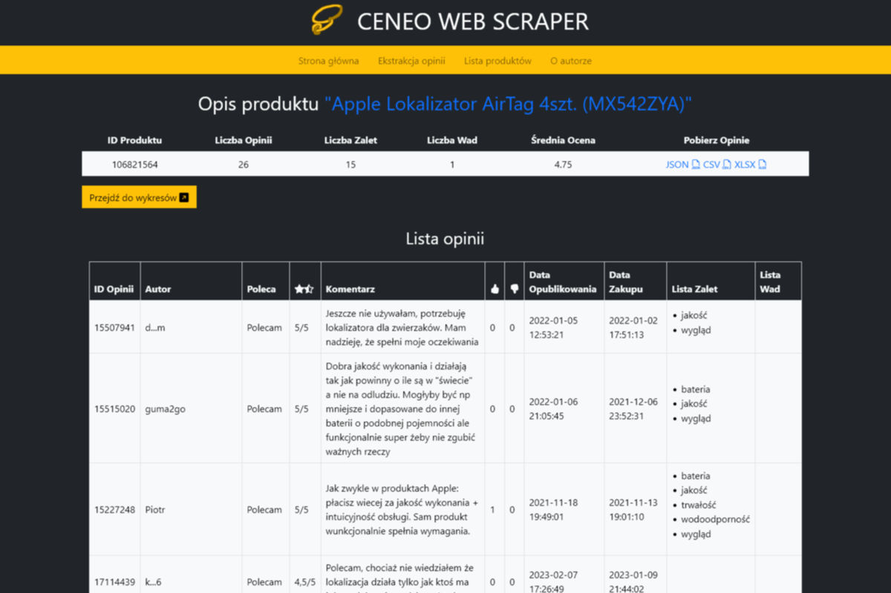

***

<h1 align="center"> 
  <sub>
    
  </sub>
  CeneoWebScraper
</h1>

***

CeneoWebScraper is a simple website-scraping project created in order to learn working with several popular Python and web libraries and packages, including the Flask microframework and the Bootstrap CSS framework.

Python >=3.10 is required to run this web application.

***

<p align="center">
  
</p>

***

## Table of contents
- [Useful documentation](#useful-documentation)
- [How to setup the Python virtual environment](#how-to-setupactivate-the-python-virtual-environment)
- [How to save the list of installed packages](#how-to-saveinstall-the-list-of-installed-packages-tofrom-a-text-file)
- [How to setup Flask](#how-to-setuprun-flask)

***

## Useful documentation
   - [Beautiful Soup](https://beautiful-soup-4.readthedocs.io/)
   - [Bootstrap](https://getbootstrap.com/docs/)
   - [Flask](https://flask.palletsprojects.com/)
   - [Pandas](https://pandas.pydata.org/docs/)
   - [Python](https://docs.python.org/)

## How to setup/activate the Python virtual environment
   - TO SETUP:

     In the ./CeneoWebScraper directory:
     ```
     python -m venv {directory name, e.g. ".venv"}
     ```

   - TO ACTIVATE:

     In the ./CeneoWebScraper directory:
     ```
     source .venv/Scripts/activate
     ```

     You know it works when after every command you enter in the terminal "(.venv)" is printed in the next line.

## How to save/install the list of installed packages to/from a text file
   - TO SAVE:
     ```
     pip freeze > {filename, usually "requirements.txt"}
     ```

   - TO INSTALL:

     Ensure that the virtual environment is active, then
     ```
     pip install -r requirements.txt
     ```

## How to setup/run Flask
   - TO SETUP:
     ```
     export FLASK_APP={run.py}
     ```

   - TO ENABLE/DISABLE DEBUG MODE:
      - **Flask version >=2.3:**
        - Enable:
          ```
          export FLASK_DEBUG=on
          ```

        - Disable:
          ```
          export FLASK_DEBUG=off
          ```

      - **Flask version <2.3:**
        - Enable:
          ```
          export FLASK_ENV=development
          ```

        - Disable:
          ```
          export FLASK_ENV=production
          ```

   - TO RUN:
     ```
     python -m flask run
     ```

     Alternatively:
     ```
     flask run
     ```
